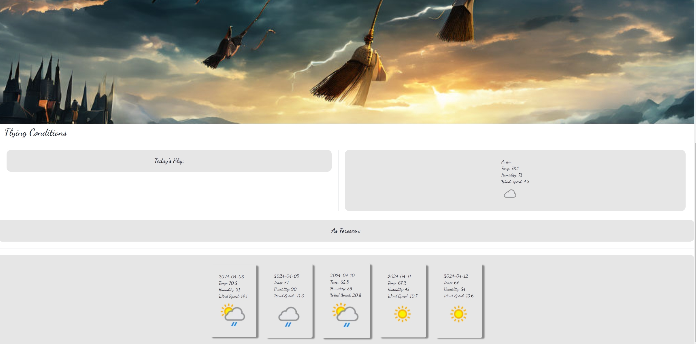
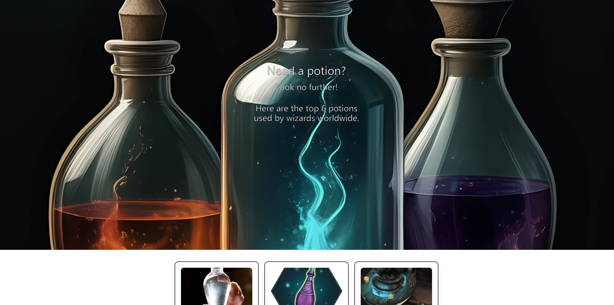

# Web-Wizards

Web-Wizards is a place specifically and uniquely designed for wizards and witches, not an ordinary fan. Our team aims to create a place where they can stop in quickly and efficiently garner pivitol information for their daily lives.  

Upon landing on the page the witch or wizard will be asked to enter the house from which they come from.  They will be given the choice of Gryffindor, Hufflepuff, Ravenclaw, or Slytherin.  Once selected their house emblem will appear as the backdrop.  If a witch or wizard has not yet been assigned to a house there will be an opportunity or option to take a quick sorting quiz to find out!

The witch or wizard will be able to access a host of information. Using two different APIs they will have access to realtime weather conditions indicating whether or not broom travel is safe, a random spell upon entering the page, and a quick look at the top 6 potions used. Also, while you are there make sure to check out the Library page where you can do some research on the Wizarding World's most famous. 

References:

APIs Used: 

[Weather](https://www.weatherapi.com/)
           
[Harry Potter](https://potterdb.com/)

Custom CSS: 

tailwind

daisyUI

Font Awesome

Screenshots:

[Web-Wizards Landing Page](./images/landingpage.jpg)

Links:

Github repository link: https://github.com/JPhanvilay/Web-Wizards

Deployed site link:
